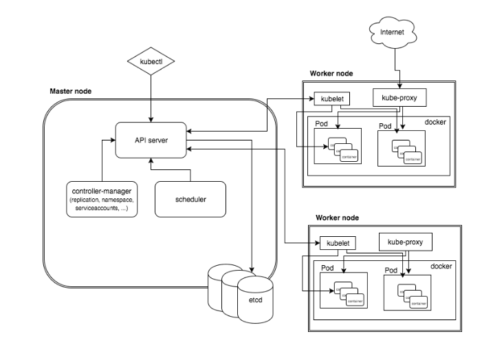

# K8S Architecture #



A K8S cluster is made up of two primary nodes:
- The master node that hosts the components that make up the K8S control plane (Actually the components can be deployed to separate servers instead of all being deployed to a single master server e.g. deploy etcd to its own cluster for security and HA reasons.)
- The worker node (or agent node or minions) that hosts your applications.

For HA, you should have multiple (odd number) of Masters.  You have as many worker nodes as need for your system(s).

The master node has the following components:
- API Server (K8S is fundamentally API driven).  All cluster management capabilities are accessed through the API server.
- Controller Manager (manages multiple controllers that ensures the current state of resources match the configured desired state).
- The Scheduler that is responsible for scheduling pods (your containerized application components) onto the worker nodes.
- The cluster state store which stores all durable state required by the K8S control plane.  State required for service discovery and cluster management is stored in this store. [etcd](https://coreos.com/etcd/) by CoreOS is an example of a highly available distributed state store that is widely used in K8S, another is [Consul](https://www.consul.io/) by Hashicorp.

The worker nodes has the following components:
- kubelet - an agent that communicates with the K8S control plane to carry out actions on behalf of the contoller managers.  It is the kubelet that deploys your containers (within pods) onto the worker nodes.  The kubelet is also responsible for controlling the lifecycle of your pods.
- kubeproxy - a component that routes requests to services to the correct pods. This service plays a key role in service discovery.  It programs local ```iptable``` rules to capture requests to service IPs and routes to the proper pods.  The service IPs are looked through a DNS service that is deployed on the cluster. 
- Container runtime - docker or rkt required to deploy your containers.

## References ##

- [Excellent community docs on K8S architecture](https://github.com/kubernetes/community/blob/master/contributors/design-proposals/architecture/architecture.md)