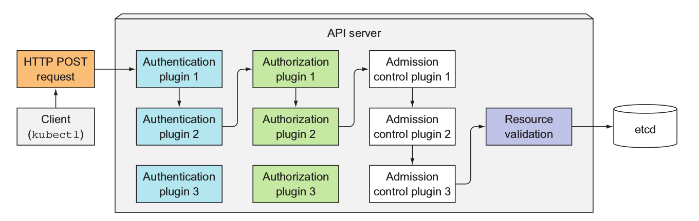

# Security #

Securing your Kubernetes cluster is a large topic.  Here we discuss Kubernetes native means to securing your cluster.  

The primary K8S capabilities for securing your workloads are:

- [RBAC (Role-Based Access Control)](#markdown-header-rbac)
- [Pod Security Policy](#markdown-header-pod-security-policy)
- [Network Security Policy](#markdown-header-network-security-policy)

**Of course, there are many other considerations to securing your cluster depending on how it is deployed. For example, key management, patching your OS, process, and many more.  Here we only cover the main K8S considerations for securing your cluster**

## RBAC ##

If you need to provide other users/roles restricted access to the K8S cluster, for example, you want "QA" roles having read/write access to only their environment, and "Dev" roles having read/write access to only their environment, then RBAC is the means to do so going forward.

**Note: AKS currently does not support RBAC. It will support RBAC when it goes GA.  As of now, to use RBAC on Azure, you need to either use ACS (Azure Container Service), a custom cluster created using acs-engine, or a custom cluster created using kubespray.**

### Authentication and Authorization in K8S ###

K8S supports a very flexible authentication/authorization model that is extensible through plugins and modules.  There are different authentication and authorization modules to support different requirements - from simple username/password to x509 certificates to Open ID Connect with an external Identity Provider, and more.

You can configure multiple authentication modules to support different authentication scenarios within your cluster.  Each of the enabled authentication modules will be invoked and short-circuited when the first module authenticates the request.  If all the modules cannot authenticate then access is denied.

Here is an excellent diagram from the [Kubernetes in Action](https://www.manning.com/books/kubernetes-in-action) book from Manning that describes this concept.



See [Controlling access to the K8S API](https://kubernetes.io/docs/admin/accessing-the-api/) to set up HTTP Basic Auth authentication, and see [Azure Active Directory plugin for client authentication with OIDC](https://github.com/kubernetes/client-go/tree/master/plugin/pkg/client/auth/azure) to set up authentication with your Azure AD tenant.

Below we will show setting up authentication and RBAC authorization using x509 certificates.

### Authenticating using x509 certs ###

#### Enabling RBAC on Minikube ####

- Start up minikube with the options to enable RBAC on the api-server.

```sh
minikube start --extra-config=apiserver.Authorization.Mode=RBAC

# required to get the kube-dns and dashboard pods to run
# See https://github.com/kubernetes/minikube/issues/1734
kubectl create -f minikube-rbac-privileges.yml
```

**MAKE SURE THE PROPER APIVERSION IS SET IN YOUR RESOURCES**

The apiVersion for RBAC has changed since v1.7 as it was still Beta at that time. Make sure you have set the proper version in the following files.

- production-role.yml
- production-rolebinding.yml
- qa-role.yml
- qa-rolebinding.yml

```yaml
#for v1.8.0 and later
apiVersion: rbac.authorization.k8s.io/v1

#for v1.7.x
apiVersion: rbac.authorization.k8s.io/v1beta1
```

Once the proper apiVersion has been set, see scripts to do this in the [certs](./certs) directory.

```sh
#1. Create credentials
openssl genrsa -out user.key 2048
openssl req -new -key user.key -out user.csr -subj "/CN=user/O=organization"
#CLUSTER_CA_LOCATION for minikube would be $HOME/.minikube
openssl x509 -req -in user.csr -CA CLUSTER_CA_LOCATION/ca.crt -CAkey CLUSTER_CA_LOCATION/ca.key -CAcreateserial -out user.crt -days 500

#2.  Create a new cluster/user context for kubectl using the user.crt/key that was just created
kubectl config set-credentials user --client-certificate=./user.crt  --client-key=./user.key
kubectl config set-context user-context --cluster=cluster --user=user

#3.  Set the current context to the user-context
kubectl config use-context user-context

#4.  Now try to do something
kubectl get pods
```

### Finding out what you can do ###

To find what you can do:

```sh
kubectl auth can-i verb resource

#can i create pods?
kubectl auth can-i create pods

#can i create pods in the kube-system namespace
kubectl auth can-i create pods --namespace kube-system

#can i create pods in the kube-system namespace as the default systemaccount user?
kubectl auth can-i get configmaps --namespace kube-system --as system:serviceaccount:kube-system:default
```

## Pod Security Policies ##

PodSecurityPolicy (PSP) resources enable the cluster admin to specify security contraints cluster wide for all pods.  In order for a Pod to be deployed onto the cluster, the pod template must meet the requirements specified in the PSP.

See [here](https://kubernetes.io/docs/concepts/policy/pod-security-policy/#what-is-a-pod-security-policy) for examples of what constraints can be specified. 

The PSPs can not only set constraints on what the pods can do, but also specify who is authorized to deploy pods with certain privileges.  For example, you can specify that only certain users can deploy pods that share the [host network namespace](https://kubernetes.io/docs/concepts/policy/pod-security-policy/#host-namespaces).

In order to leverage PSPs, you need to enable it on the cluster.  The quickest way to determine if PSPs are enabled is to run the following command:

```sh
kubectl get psp

#This means PSP is enabled
No resources found.

#This means PSP is not enabled
the server doesn't have a resource type "psp"
```
If PSP is not enabled, you will need to enable the PodSecurityPolicy AdmissionController on your cluster.  This is done by passing an option to the kube-apiserver.  Unfortunately, this is not possible on AKS as you do not have access to the master nodes.  On ACS, the approach is to use [acs-engine](https://github.com/Azure/acs-engine) to create a custom cluster with it enabled.  Note, you also need to enable AppArmor on all your nodes.  You can do this via acs-engine.

See [restrict-hostport.yaml](./restrict-hostport.yaml) and [restrict-root.yaml](./restrict-root.yaml) for examples.

## Network Security Policies ## 

By default, any pod can communicate with any other pod in the cluster.  However, what about if you wanted so control what pods can communicate with other pods?  What would be the equivalent to Azure [network security groups](https://docs.microsoft.com/en-us/azure/virtual-network/virtual-networks-nsg) in Kubernetes?  That would be [Network Policies](https://kubernetes.io/docs/concepts/services-networking/network-policies/).

Network policies enable you to specify how a group of pods communicate with each other. For example, let's say you want to ensure pods can only communicate with other pods in the same namespace, you can achieve this with network policies.

Here is an example of a Network Policy that prevents ingress access to the database pods from anything except pods with the label `access=true`.  Note, Network Policies are applied at the namespace level.

```yaml
kind: NetworkPolicy
apiVersion: networking.k8s.io/v1
metadata:
  name: db-access
spec:
  #This policy applies to those pods with label 'service=database'
  podSelector:
    matchLabels:
      service: 'database'
  #This is the ingress rule.  It will only allow ingress from those
  #pods that have the label 'access=true'
  ingress:
  - from:
    - podSelector:
        matchLabels:
          access: 'true'
```

See this this [blog post on k8s.io](http://blog.kubernetes.io/2017/10/enforcing-network-policies-in-kubernetes.html) for more info on Network Policies.  See also the excellent [Network Policy Recipes](https://github.com/ahmetb/kubernetes-network-policy-recipes) for some in-depth examples of policies.

## Reference ##

- [Using RBAC Authorization](https://kubernetes.io/docs/admin/authorization/rbac/)
- [OpenID Connect Auth Flow on Azure AD](https://docs.microsoft.com/en-us/azure/active-directory/develop/active-directory-protocols-openid-connect-code)
- [K8S Authentication with OpenID Connect tokens](https://kubernetes.io/docs/admin/authentication/#openid-connect-tokens)
- [Excellent guide by Bitami](https://docs.bitnami.com/kubernetes/how-to/configure-rbac-in-your-kubernetes-cluster/)
- [CNCF - Effective RBAC Youtube video](https://www.youtube.com/watch?v=Nw1ymxcLIDI)
- [Autogenerating RBAC manifests from K8S audit logs](https://github.com/liggitt/audit2rbac)
- [Excellent guide by Bitami on Pod Security Policies](https://docs.bitnami.com/kubernetes/how-to/secure-kubernetes-cluster-psp/)
- [Encrypting Secrets at Rest](https://kubernetes.io/docs/tasks/administer-cluster/encrypt-data/)
- [Network Security Policy](https://kubernetes.io/docs/tasks/administer-cluster/declare-network-policy/)