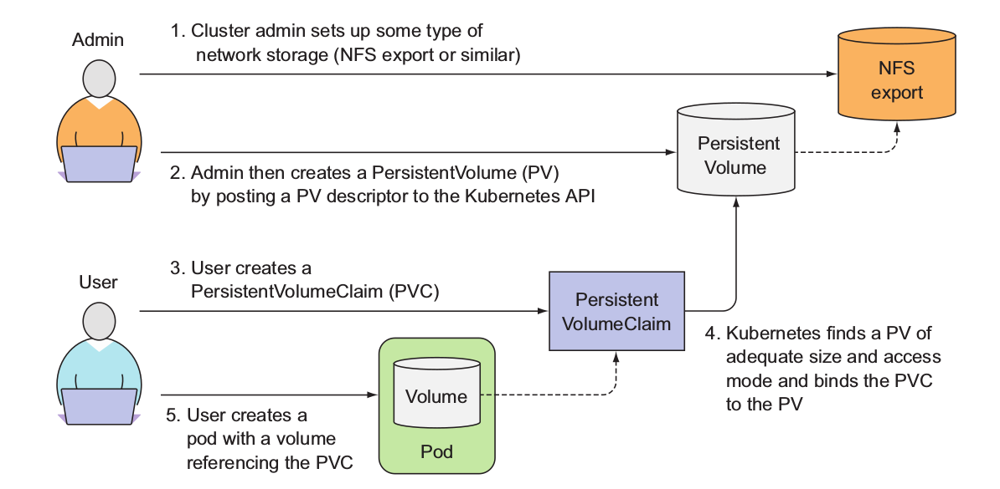

# Storage #

## Volumes ##

For those applications that need to manage durable state, particularly, state that survives across container restarts, K8S provides the volume resource - there are multiple volume types such as NFS, [Azure Disk](https://github.com/kubernetes/examples/tree/master/staging/volumes/azure_disk), [Azure File](https://github.com/kubernetes/examples/blob/master/staging/volumes/azure_file/README.md), and more.

To the containers, volumes are just directory on the disk.  The Docker image is at the root of the file system, and you can mount multiple volumes at specified paths within the image.  Each container in the pod must independently specify where to mount each volume.

Which volume type you use depends on your requirements:

- emptyDir volume type uses either memory or local filesystem for storage.  It only should be used for temp data
- hostPath volume maps the volume to a specific directory on the node.  This is useful if you have a daemonset that needs to access the same directory on all nodes.
- nsf volume type uses network storage using the nfs protocol.  Note there are many volume types that support network storage.  For example, azureDisk, awsElasticBlockStore.  These are the volume types that you want to use so that when your pods are rescheduled to different nodes, the same volumes are still accessible.

* See the [Volume reference at K8S.io](https://kubernetes.io/docs/concepts/storage/volumes/) for more details.
* See [here](https://github.com/kubernetes/examples/blob/master/staging/volumes/azure_disk/azure.yaml) for an example of a pod that uses Azure Disk volumes.  Notice how you must first specify the volume, then mount the volume within your container specification.  How you specify the volume depends on the volume type.

## Persistent Volumes & Persistent Volume Claims ##

With Volumes the life-cycle of the storage is tied to the pod.  This means the volume survives container restarts, however, if the pod is destroyed, the volume storage will be blown away - not entirely true, this is the case for certain volume types e.g. emptyDir. This is not appropriate for applications such as databases that require the data is saved even if the pod is rescheduled to another node.  In addition, with volumes Developers has to be aware of the underlying storage implementation.  For example, if you used an nsf volume type, the Developer would need to know about the nsf server, or if you used azureDisk, you would have to know the url to the azure storage and storage account details.  Developers should not have to be aware of these infrastructure level details.  Persistent Volumes, Persistent Volume Claims and Storage Classes abstract away much of these details from the Developers.

Persistent Volumes (PV) are a volume type that is pre-provisioned/defined by the cluster admin - they can be provisioned statically or dynamically.  They support different storage services via plugins.  For example, there is a PV type for AzureFile, AzureDisk, NFS and more.  They differ from volumes in that the cluster admin can pre-create volumes as resources that can be used by creators of the pods. This is beneficial as the pod creators do not have to be aware of the implementation details of the volumes - e.g. credentials, access keys, etc.

Persistent Volume Claims (PVC) are how pods "claim" the provisioned storage. In the claim is the request for amount of storage and access modes. A claim is fulfilled if there is a PV that meets the criteria specified in the claim.  Note this means that it is possible for a claim not to be fulfilled.  Once a PVC is bound to a PV, that relationship is one to one. What this means is that even if the Pod is rescheduled, the volume is not reallocated because there is a PVC that claims that volume.  The volume is only reallocated when the PVC is removed.

Here is an excellent diagram from the [Kubernetes in Action](https://www.manning.com/books/kubernetes-in-action) book from Manning that describes this concept.



See the following example manifests from K8S.io:

* [persistent-volume.yml](./persistent-volume.yml)
* [pvc-01.yml](./pvc-01.yml)
* [pv-pod-01.yml](./pv-pod-01.yml)

*Note: It is very important that you do not remove PVCs indiscriminantly!!! K8S 1.9 does have an alpha feature that will not remove PVCs that are in active use by a pod.  However, this needs to be enabled and prior versions do not have any such safety net.*

*Note: How a PV is reclaimed after a PVC is removed depends on the reclaim policy - Retain, Recycle, Delete. Delete is the most destructive as it also deletes the PV and the underlying backing storage.  Not all storage providers support all policies. See [reclaim policies](https://kubernetes.io/docs/concepts/storage/persistent-volumes/#reclaiming) for details*

## Storage Classes ##

*Note: You only need to be aware of storage classes if you are a cluster admin.*

Storage classes enable cluster admins to define different classes of persistent volumes.  These classes could vary by access modes, reclaim policy, storage provider (e.g. Azure, AWS, NFS, etc) and more.  The cluster admin can also specify a default storage class for those PVCs that do not specify a storage class.  If the cluster admin wants to enable dynamic provisioning of the underlying storage, then they must define storage classes.

*Note: All cloud providers provide pre-defined storage classes.  You can define others as you see fit for your requirements*

Storage classes also serves to abstract away the underlying storage implementation from the pod. This is beneficial when you have developers using a tool like minikube for development and production uses K8S on a cloud provider like Azure.  Instead of the pod definition being aware of the underlying storage implementation, it can use a PVC that specifies a storage class that uses the same name but different implementation across environments.

To find out what storage classes have been defined for you cluster run:

```bash
kubectl get storageclasses

#On Azure, this is what is returned

NAME                PROVISIONER
azurefile           kubernetes.io/azure-file
default (default)   kubernetes.io/azure-disk
managed-premium     kubernetes.io/azure-disk
managed-standard    kubernetes.io/azure-disk
```

Notice the default storage class is azure-disk.  This is the class that is used if a PVC does not specify a storage class.  To use a different storage class you would specify the desired storage class in your PVC's ``storageClassName`` attribute.

To get details of a specific storage class run:

```sh
kubectl describe storageclass/managed-premium
```

To get the details in yaml format run:

```sh
kubectl get storageclass/managed-premium -o=yaml
```

##  Understand The Constraints Of The Underlying Storage Implementation ##

It is very important to understand the constraints imposed by the underlying storage implementation.  For example, on Azure there are two provisioners - azureDisk and azureFile.  azureDisk comes in standard (e.g. spinning, magnetic disks) and premium (.e.g SSD), they are disks that are mounted onto a specific node and Azure has fixed limits on how many data disks can be mounted onto a given VM size.  Furthermore, azureDisk only supports ReadWriteOnce access mode.  What this means is that only one pod can have read/write access to a given disk.  Therefore, for stateful applications, you need to think hard about how many replicas you need to determine how many data disks you need, and hence the appropriate VM size for the node.  

Azure also has the azureFile provisioner.  This provisioner essentially mounts a CIFS/Samba fileshare.  This has some limitations in that even though the cluster may be Linux, the underlying storage implementation will CIFS and hence does not support all Linux filesystem capabilities (e.g. symlinks)  It is also significantly slower than azureDisk.  On the other hand, AzureFile does support more access modes than Azure Disk.

So you need to consider you use-cases and provisioner constraints to make the right decision.  In general:

* For fast performance and restrictive access modes e.g. databases use AzureDisk Premium
* For storage requirements for data that does not change often, e.d. static html, pre-rendered javascript, etc, that needs to be accessed by many pods then use AzureFile.

## Other Limitations To Be Aware of ##

Currently, the volumes that are mounted on a node require root permissions to access. This is a major problem because the best practices with Docker images is to NOT run in privileged mode.  As much as possible, the process in the container should run as a specific UID/GID that is not root.  There are different way to deal with this depending on the volume implementation, however, the most standard way right now is use to initContainers.  An initContainer is a container that does some initialization work that must complete successfully prior to the primary container starting.  You can have the init container start up as root but then run `chown -R UID:GID path` to change owner and hence permissions to the UID:GID the primary container will run as.

See [pod-non-root](./pod-non-root/README.md) for an example.

Here is the issue that describes the problem - https://github.com/kubernetes/kubernetes/issues/2630.  Note, this issue is scheduled to be addressed in the next major milestone.

## References ##

* [Volumes](https://kubernetes.io/docs/concepts/storage/volumes/)
* [Persistent Volumes](https://kubernetes.io/docs/concepts/storage/persistent-volumes/)
* [Storage Classes](https://kubernetes.io/docs/concepts/storage/storage-classes/)
* [Dynamic Volume Provisioning](https://kubernetes.io/docs/concepts/storage/dynamic-provisioning/)
* [Persistent Volumes with Azure Disk](https://docs.microsoft.com/en-us/azure/aks/azure-disks-dynamic-pv)
* [Persistent Volumes with Azure File](https://docs.microsoft.com/en-us/azure/aks/azure-files-dynamic-pv)