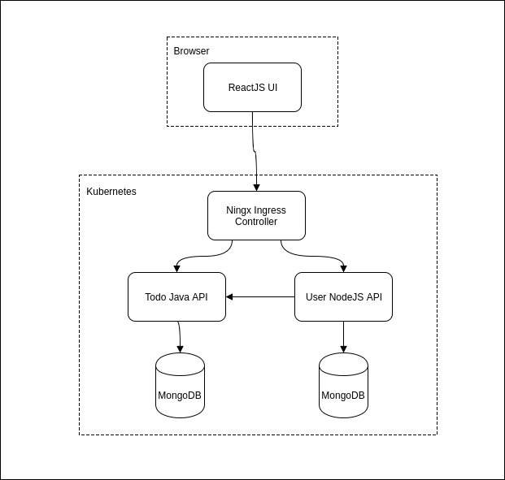

# Todo List Microservice Application #

The Todo application is a simple microservice based application comprised of a ReactJS UI, a node Users API and a Java TodoItem API.  For a database, mongodb is leveraged.  We will use this application to learn about many of the core K8S concepts.

# Developers #

To build, test and deploy the application see the Developers [guide](./DEV-README.md).